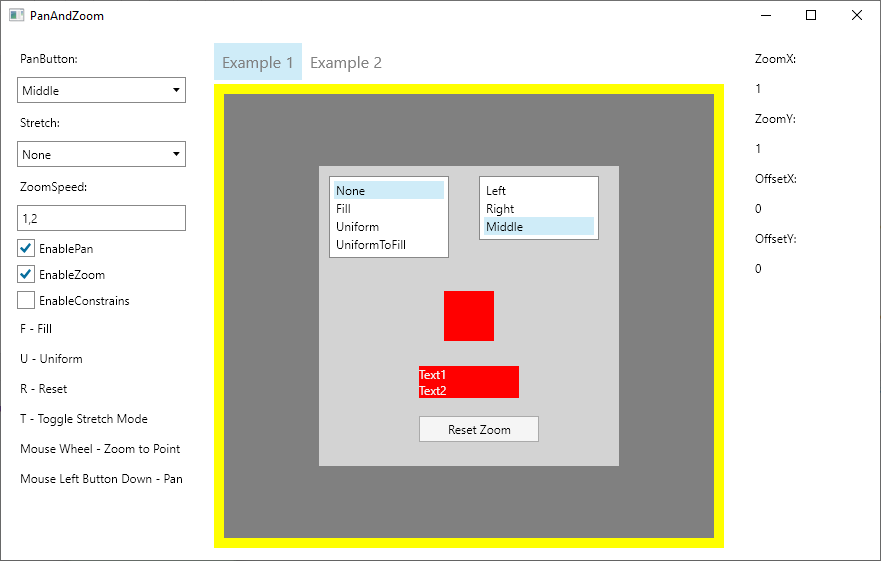

  
<i class="bi bi-bounding-box-circles" aria-hidden="true"></i> Avalonia Control and Testing Toolkit

  

    

      <h1>PanAndZoom for Avalonia</h1>
      
<strong>PanAndZoom</strong> packages a production-ready <code>ZoomBorder</code> control for pan, zoom, bounds management, and view-state workflows, plus <strong>HeadlessTestingFramework</strong> for gesture simulation, tree inspection, Appium-style APIs, and visual recording in Avalonia tests.

      

        <a class="btn btn-primary btn-lg" href="articles/getting-started/overview"><i class="bi bi-rocket-takeoff" aria-hidden="true"></i> Start Getting Started</a>
        <a class="btn btn-outline-secondary btn-lg" href="articles/headless-testing"><i class="bi bi-bezier2" aria-hidden="true"></i> Explore Testing APIs</a>
        <a class="btn btn-outline-secondary btn-lg" href="api"><i class="bi bi-braces-asterisk" aria-hidden="true"></i> Browse API</a>
      

    

    

      
    

  

## Start Here

  <a class="paz-link-card" href="articles/getting-started/installation">
    <i class="bi bi-download" aria-hidden="true"></i> Installation
    
Package setup for both libraries, headless test prerequisites, and the first integration checks.

  </a>
  <a class="paz-link-card" href="articles/getting-started/quickstart-zoom-border">
    <i class="bi bi-arrows-move" aria-hidden="true"></i> Quickstart: ZoomBorder
    
Create a zoomable surface, bind commands, and wire pointer and keyboard interaction.

  </a>
  <a class="paz-link-card" href="articles/getting-started/quickstart-headless-testing">
    <i class="bi bi-bug" aria-hidden="true"></i> Quickstart: Headless Testing
    
Drive Avalonia controls with touch, keyboard, and Appium-style APIs inside headless tests.

  </a>
  <a class="paz-link-card" href="articles/samples">
    <i class="bi bi-window-stack" aria-hidden="true"></i> Sample Walkthrough
    
Map the sample app tabs to concrete ZoomBorder features and testing scenarios.

  </a>

## Packages

  <a class="paz-link-card" href="articles/intro">
    <i class="bi bi-zoom-in" aria-hidden="true"></i> PanAndZoom
    
<code>ZoomBorder</code>, matrix helpers, commands, history, state persistence, bounds control, and advanced viewport utilities.

  </a>
  <a class="paz-link-card" href="articles/headless-testing">
    <i class="bi bi-camera-video" aria-hidden="true"></i> HeadlessTestingFramework
    
Input simulation, tree queries, template inspection, recording, video conversion, and Appium-like interaction layers.

  </a>

## Documentation Sections

  <a class="paz-link-card" href="articles/getting-started">
    <i class="bi bi-signpost-split" aria-hidden="true"></i> Getting Started
    
Choose the right package, install it, and get your first sample or test working quickly.

  </a>
  <a class="paz-link-card" href="articles/concepts">
    <i class="bi bi-diagram-3" aria-hidden="true"></i> Concepts
    
Coordinate systems, transformation state, gestures, commands, and persistence mental models.

  </a>
  <a class="paz-link-card" href="articles/guides">
    <i class="bi bi-journal-code" aria-hidden="true"></i> Guides
    
Scenario-driven recipes for bounds management, view history, keyboard control, zoom-to-rectangle, and more.

  </a>
  <a class="paz-link-card" href="articles/headless-testing">
    <i class="bi bi-cpu" aria-hidden="true"></i> Headless Testing
    
Testing workflows spanning gesture simulation, tree introspection, Appium-like APIs, and recording.

  </a>
  <a class="paz-link-card" href="articles/advanced">
    <i class="bi bi-speedometer2" aria-hidden="true"></i> Advanced
    
Custom bounds and resize hooks, ScrollViewer integration, diagnostics, and project-level testing strategy.

  </a>
  <a class="paz-link-card" href="articles/reference">
    <i class="bi bi-collection" aria-hidden="true"></i> Reference
    
Namespace maps, API coverage, Lunet pipeline details, and licensing.

  </a>

## Repository

- Source code and issues: [github.com/wieslawsoltes/PanAndZoom](https://github.com/wieslawsoltes/PanAndZoom)
- Published docs target: [wieslawsoltes.github.io/PanAndZoom](https://wieslawsoltes.github.io/PanAndZoom)
